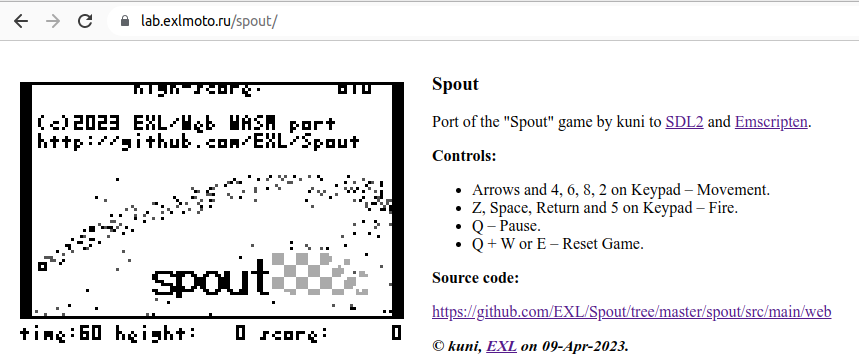

Spout
=====

Port of the "Spout" game by kuni to SDL2 and Emscripten.

## Web Demo

* [Spout Web](https://lab.exlmoto.ru/spout/) page.
* [Spout Web](https://exlmotodev.github.io/spout/) mirror page.

## Key controls (Linux)

* Arrows and 4, 6, 8, 2 on Keypad – Movement.
* Z, X, Space, Return – Fire.
* Escape – Pause.
* Escape + Right or Left Shift – Exit Game.

## Key controls (Web)

* Arrows and 4, 6, 8, 2 on Keypad – Movement.
* Z, Space, Return and 5 on Keypad – Fire.
* Q – Pause.
* Q + W or E – Reset Game.

## Additional information

See root "[ReadMe.md](../../../../ReadMe.md)" document.
